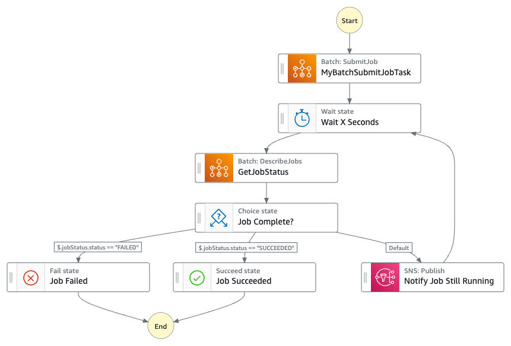

# AWS Batch job duration notifier

This Python CDK application deploys a no-code serverless architecture to create an AWS Step Functions state machine to submit an AWS Batch job, wait for a specified amount of time, then, if the job has not completed, publish a notification to an Amazon SNS topic. This can help to notify if a running Batch job is potentially in a stuck state, enabling the user to take some action.

## State Machine flow



## Prerequisites

- An active AWS account
- AWS Command Line Interface (AWS CLI) [installed](https://docs.aws.amazon.com/cli/latest/userguide/getting-started-install.html) and [configured](https://docs.aws.amazon.com/cli/latest/userguide/cli-chap-configure.html) to work with the AWS account.
- AWS CDK [installed](https://docs.aws.amazon.com/cdk/v2/guide/getting_started.html)
- Python 3 [installed](https://www.python.org/downloads/)

## Getting Started

This project uses [_projen_](https://projen.io/). _projen_ doesn't need to be installed. You can use [npx](https://docs.npmjs.com/cli/v7/commands/npx) to run _projen_ to deploy the CDK stack.

```console
$ python3 -m venv .env
$ source .env/bin/activate
$ npx projen install
👾 install ...
...
$ npx projen synth
👾 synth...
...
npx projen deploy
👾 deploy
...
```

## Execute the Step Function state machine

Use the AWS cli to get the state machine arn.

```console
aws stepfunctions list-state-machines
```

Execute the state machine.

```console
aws stepfunctions start-execution --state-machine-arn [your state machine arn] --input '{ "jobName": "my-job", "wait_time": 60 }'
```

## Cleanup

```console
$ npx projen destroy
👾 destroy
...
```
